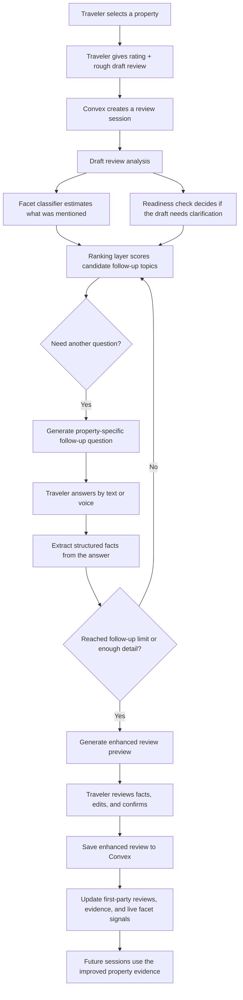

# ReviewGap

AI that helps travelers write high-signal hotel reviews instead of one-line blurbs.

ReviewGap turns a rough draft like "good stay, breakfast was crowded" into a stronger, more useful review by asking targeted follow-up questions, extracting the concrete facts, and drafting a polished final version for the traveler to approve. The goal is simple: make reviews more useful for the next guest and more informative for the platform.

## The Problem

Most hotel reviews are too vague to be decision-useful.

Travelers usually mention whether they liked a stay, but skip the operational details that actually matter when someone is booking:

- Was check-in smooth?
- Was breakfast worth it?
- Was parking available or unexpectedly expensive?
- Did the listing match the real experience?

That leaves a massive information gap between what properties advertise and what travelers actually experience.

## What ReviewGap Does

ReviewGap is an AI review copilot for hospitality platforms.

It asks the quiet follow-up questions other travelers wish had been answered, then converts the conversation into a structured, review-ready output.

### Demo Flow

1. The traveler picks a property and gives an overall rating.
2. They write a short draft review in plain language.
3. ReviewGap analyzes what topics were mentioned and what important gaps remain.
4. It selects up to two high-value follow-up questions based on property-specific evidence.
5. It extracts structured facts from the answers and drafts an improved review.
6. The traveler can review, edit, deselect facts, and save the final version.

The saved review is then attached back to the property and blended into the live evidence pipeline for future sessions.

## How It Works

ReviewGap combines deterministic ranking, lightweight ML, and optional LLM assistance.

### Review System Diagram



### 1. Property Understanding

We seed the system with source property data and review history, then build runtime property records that include:

- listing summaries
- amenity and policy evidence
- facet-level metrics like freshness, coverage, and conflict
- live review signals blended from vendor reviews and first-party traveler reviews

### 2. Draft Review Analysis

When a traveler starts typing, ReviewGap analyzes the review to determine:

- which facets were already mentioned
- which facets the traveler likely knows about
- whether the draft is detailed enough for a follow-up
- the current sentiment of the review

### 3. Follow-Up Question Selection

The system ranks candidate facets using a scoring layer that prioritizes:

- high-importance topics
- stale or under-covered property information
- listing-vs-review conflict
- whether the traveler has already mentioned the topic
- whether the traveler is likely to know the answer

If a learned ranker artifact is available, it can shadow or serve ranking decisions; otherwise the system falls back to the heuristic scorer.

### 4. Fact Extraction and Review Generation

After the follow-up answers come in, ReviewGap:

- extracts structured facts
- infers trip context and aspect ratings where possible
- drafts a cleaner, more complete final review
- lets the user confirm or edit the extracted facts before saving

## ML Highlights

This project is not "LLM wrapper" logic. There is a real ML and data layer behind the experience.

### Facet Classifier

We train and serve a TF-IDF based facet classifier that predicts whether a draft review mentions important topics such as:

- check-in
- check-out
- breakfast
- parking
- pool
- know-before-you-go issues

At runtime, the model produces both mention probabilities and "likely known" probabilities to help decide what is worth asking next.

### Learned Ranker + Heuristic Ranker

ReviewGap supports both:

- a deterministic heuristic ranker for reliable hackathon demos
- learned ranker artifacts for experimentation and offline evaluation

That gives us a production-safe default path while still letting us test whether supervised ranking improves question quality.

### Semantic EDA and Retrieval Signals

In the `EDA/` pipeline, we analyzed thousands of reviews to study:

- coverage gaps across hotel facets
- listing-vs-review drift
- validated conflicts between claims and experiences
- multilingual behavior
- temporal drift over time
- whether supervised ML is worth using in the stack

Those findings directly shaped the product logic, especially around which facets are safe to prioritize in the MVP.

## Why This Matters

ReviewGap helps three different stakeholders at once:

- Travelers get a better writing experience and a better final review.
- Future guests get more decision-useful information.
- Platforms get richer, more structured first-party review data.

Instead of waiting for users to naturally write great reviews, the system actively helps them produce better ones.

## Stack

- Next.js 16 + React 19 for the product UI
- Convex for real-time backend logic, storage, and authenticated actions
- Clerk for authentication
- OpenAI for optional review analysis, phrasing, realtime session support, and audio transcription
- TypeScript across the app and backend services
- Python scripts in `EDA/` for training, evaluation, artifact generation, and data preparation

## What We’re Proud Of

- A complete end-to-end loop from draft review to saved enhanced review
- A backend that works even without OpenAI through conservative fallback logic
- A real data-science pipeline instead of presentation-only AI claims
- Blending vendor review data with first-party traveler submissions in the live ranking system
- A polished interface that feels like a guided writing experience instead of a form

## Challenges

- Balancing trustworthy deterministic logic with flexible AI phrasing
- Avoiding over-asking and keeping the review flow lightweight
- Turning noisy travel-review text into structured, editable facts
- Figuring out which ML signals were actually safe to productize versus just interesting offline

## What’s Next

- Expand beyond hospitality into other review-heavy verticals
- Improve multilingual coverage
- Add stronger ranking evaluation from live user interactions
- Personalize follow-ups using stay context and traveler intent
- Turn extracted facts into richer search and ranking signals for booking platforms

## Repo Guide

If you want a codebase snapshot in one file, see [REPOSITORY_PACK.md](./REPOSITORY_PACK.md).

Key directories:

- `app/` UI, routes, and API handlers
- `convex/` schema, actions, queries, and mutations
- `src/backend/` ranking, ML, fact extraction, runtime logic, and store adapters
- `EDA/` notebooks, findings, training scripts, and generated artifacts
- `scripts/` seeding and demo utilities
- `tests/` unit and flow coverage

## Run Locally

```bash
pnpm install
pnpm dev
```

Then seed the demo data:

```bash
pnpm run seed:demo
```

Useful commands:

```bash
pnpm run build
pnpm run typecheck
pnpm test
pnpm run check
```

## Environment Notes

`pnpm dev` starts local Convex and Next.js together. Convex generates the local app URL automatically.

Set these only if you want the authenticated and OpenAI-backed experience:

```bash
NEXT_PUBLIC_CLERK_PUBLISHABLE_KEY=...
CLERK_SECRET_KEY=...
CLERK_JWT_ISSUER_DOMAIN=https://your-instance.clerk.accounts.dev
OPENAI_API_KEY=...
```

Without `OPENAI_API_KEY`, the project still works through deterministic fallback paths where supported.

## Data + Research

The data science work is documented in [EDA/README.md](./EDA/README.md), including:

- facet coverage analysis
- semantic review analysis
- threshold validation
- ML feasibility experiments
- artifact generation for the app runtime
