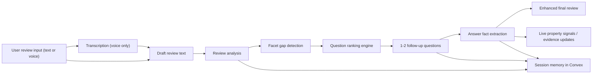
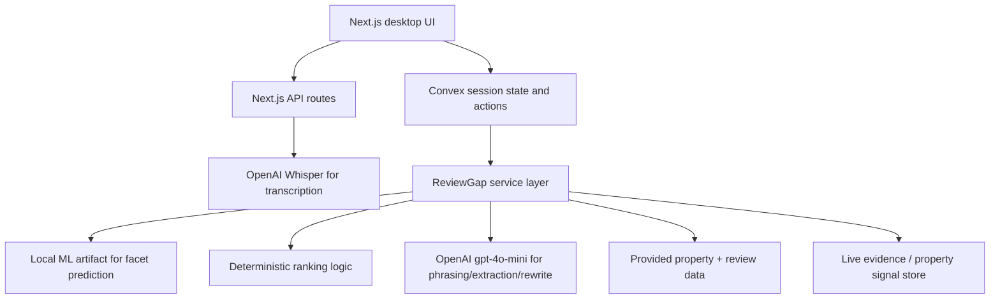

# Hackathon MVP Plan

## Product thesis

Travelers often leave short, incomplete reviews because writing a useful review takes work. Our product reduces friction by letting guests leave a review in text or voice, then asks 1 to 2 targeted follow-up questions that fill the highest-value information gaps for future travelers.

The novelty is not "AI writes a review." The novelty is a cost-aware review completion pipeline that:

- captures more reviews with low-friction voice input
- identifies what is missing from the review using only available property and review data
- asks only the most useful follow-up questions
- converts answers into structured, traveler-useful signals
- updates property understanding in near real time

## Scope decisions

- Prioritize desktop prototype over polished multi-platform UI.
- Keep the interface functional and simple. Do not spend time on pre/post comparison screens in-product.
- Show pre/post impact in slides or the demo video instead.
- Use only the data already available in the provided dataset and the existing 31-column property schema.
- Do not assume Expedia integration is required.
- Limit the live demo to 1 to 2 follow-up questions per session.

## MVP user flow

1. User selects a property.
2. User leaves an initial review by typing or speaking.
3. Speech is transcribed to text when voice is used.
4. The system analyzes the draft review and predicts which facets were mentioned and which useful facets are still missing.
5. The ranking engine selects the single highest-value follow-up question based on importance, staleness, conflict, and coverage gap.
6. The user answers 1 to 2 short follow-up questions.
7. The system extracts structured facts from the answers.
8. The system generates an improved final review draft and updates live property signals.

## End-to-end pipeline

## High-level system architecture

## What to highlight in the pitch

- Low-friction review capture: users can speak instead of writing a full review.
- Guided review completion: the system does not assume the user already wrote a detailed review.
- Cost-aware intelligence: cheap local scoring decides whether and what to ask before invoking an LLM.
- Traveler usefulness: follow-up questions are chosen to maximize information value, not just conversation.
- Realistic data usage: the system works on the provided schema and available review/listing data.

## Novel component deep dive

If we include one deeper technical slide, it should be the question selection engine.

Why this is the right deep dive:

- It is the most defensible part of the system.
- It ties directly to usefulness for future travelers.
- It supports the cost-savings argument because it bounds LLM usage.
- It is easier to explain than a general "AI orchestration" slide.

Deep-dive framing:

- Input: draft review text, property facets, prior review evidence, listing text, staleness/conflict signals
- Logic: rank missing facets by business value and expected information gain
- Output: only the top 1 to 2 questions
- Impact: more complete reviews, fewer unnecessary model calls, faster review completion

## Cost-savings story

The core argument is that we do not use a heavyweight model to run the whole review flow.

Instead:

- use local ML to predict likely mentioned / known facets
- use deterministic ranking to decide if a follow-up is worth asking
- use a small model only for narrow language tasks:
  - phrasing the chosen question
  - extracting structured facts from the answer
  - rewriting the final review
- keep question count capped at 1 to 2
- support fallback behavior when AI is unavailable

This lets us argue:

- lower cost per completed review
- lower latency than fully agentic generation
- better scalability for real-time product use

For the demo, prefer bounded, defensible metrics such as:

- average number of model calls per session
- average follow-up questions per session
- percent of sessions completed without needing more than 2 follow-ups
- percent increase in covered high-value facets before vs. after follow-ups

Only present dollar estimates if we benchmark them from actual requests.

## Demo priorities

- Working desktop flow
- Voice input working end to end
- Clear follow-up question selection
- Final enhanced review output
- Simple evidence of property signal updates

Nice to have, not core:

- heavy UI polish
- complex comparison views
- deep personalization visuals in-product

## Slide structure

1. Problem: travelers leave incomplete reviews because review writing is high-friction.
2. Insight: the missing value is not more reviews alone, but better targeted review detail.
3. Solution: voice-first review completion with adaptive follow-up questions.
4. Architecture: one high-level pipeline slide.
5. Novelty deep dive: question ranking / information gain engine.
6. Demo: user speaks, system asks, system enriches.
7. Impact: better review quality, realistic deployment path, lower cost than heavy end-to-end LLM flows.

## Current repo alignment

The current codebase already supports most of this story:

- voice transcription endpoint exists
- Convex session and review state exist
- facet analysis and deterministic ranking exist
- follow-up question generation exists
- answer fact extraction exists
- enhanced review generation exists
- live property evidence updates exist

That means the remaining work should focus on reliability, demo flow, and concise explanation rather than UI redesign.
